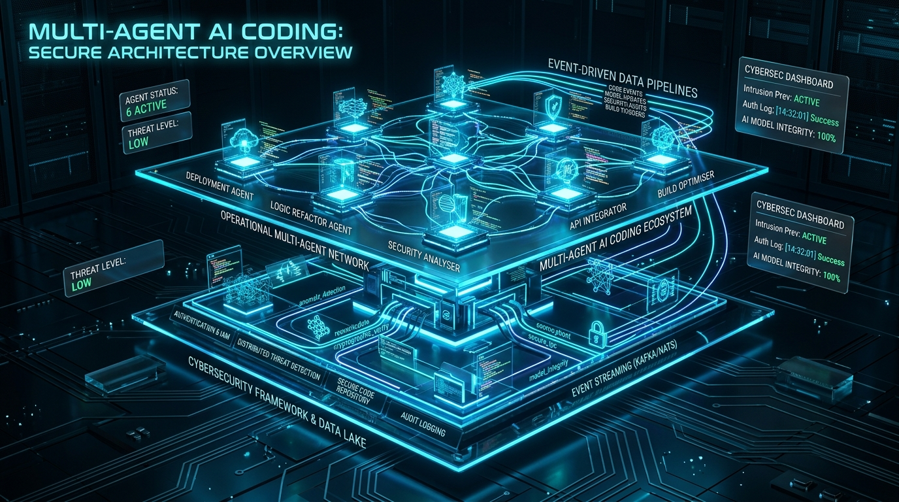
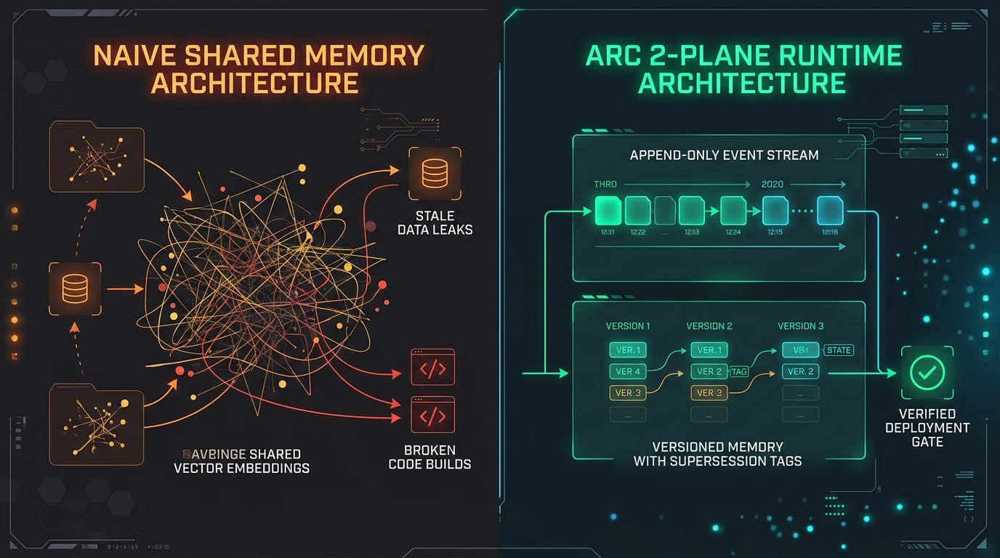

# ARC — Adaptive Agent Runtime

> **Reliable context control for long-horizon multi-agent coding.**

[](https://github.com/anatwork14/adaptive-agent-runtime/actions/workflows/ci.yml)
[](https://www.python.org/)
[](LICENSE)
[](https://anatwork14.github.io/adaptive-agent-runtime/)

<p align="center">
  
</p>

<p align="center">
  👉 <strong><a href="https://anatwork14.github.io/adaptive-agent-runtime/">Explore the Interactive Live Documentation & Architecture Simulator</a></strong>
</p>

ARC is a research-oriented runtime for coordinating coding agents without treating chat history, summaries, or vector memory as project truth.

The core rule is:

> **Adaptive memory is never authoritative.**

The authoritative project state is an append-only event stream plus git state. Memory is a rebuildable, versioned projection used to compile the smallest useful context for each task.

**Project status:** experimental / pre-alpha. The control-plane architecture is implemented, but provider CLI compatibility, container-level isolation, semantic embeddings, and repository-scale evaluation are still active work. Do not run untrusted agent-generated code on a sensitive host yet.

---

## Why ARC exists

Adding more coding agents creates new failure modes:

- Agent B receives stale assumptions from Agent A.
- Transcript handoff becomes expensive and noisy.
- Summaries silently lose constraints.
- Vector retrieval returns facts that were already superseded.
- Two agents duplicate the same exploration.
- A patch is "verified" against the wrong repository tree.
- Failed attempts disappear, so the next worker repeats them.

ARC treats these as **state, context, and integration problems**, not prompt-engineering problems.

<p align="center">
  
</p>

---

## Architecture

<p align="center">
  
</p>

```text
                              USER / TASK SPEC
                                     │
                                     ▼
                              versioned Task DAG
                                     │
                                     ▼
                    ┌─────────────────────────────┐
                    │ ORCHESTRATOR — single writer│
                    └──────────────┬──────────────┘
                                   │
                  ┌────────────────┴────────────────┐
                  ▼                                 ▼
       AUTHORITATIVE STATE                 ADAPTIVE MEMORY
       append-only events                  derived projection
       task/version state                  provenance
       leases + budgets                    validity intervals
       candidate commits                   supersession
       gate outcomes                       failure/procedure memory
                  │                                 │
                  └────────────────┬────────────────┘
                                   ▼
                           CONTEXT COMPILER
                     hard budget + real code evidence
                                   │
                                   ▼
                        immutable ContextPacket
                                   │
                                   ▼
                       isolated agent worktree
                                   │
                                   ▼
                         candidate git commit
                                   │
                                   ▼
                    SERIALIZED INTEGRATION GATE
                      cherry-pick candidate into
                      temporary verification tree
                                   │
                         ┌─────────┴─────────┐
                         ▼                   ▼
                       reject             accept
                                             │
                                             ▼
                                  cherry-pick into integration
```

### Correctness boundary

If deleting ARC's memory database/indexes would make you lose what **actually happened**, that information was stored in the wrong place.

The event log must be sufficient to reconstruct authoritative project state. Derived memory can be rebuilt from recorded `memory.materialized` events without re-running a summarizer or model.

---

## What changed in the hardened runtime

The current branch/runtime addresses several prototype failure modes:

### 1. The integration gate validates the actual patch

Agent changes are first materialized as an immutable candidate commit.

The gate then:

<p align="center">
  
</p>

```text
candidate commit
      ↓
fresh gate worktree at current integration HEAD
      ↓
cherry-pick candidate
      ↓
static checks / configured visible tests / review
      ↓
PASS → cherry-pick same candidate into integration
FAIL → discard candidate integration attempt
```

The gate no longer validates the unchanged main tree while the agent's work disappears in a temporary worktree.

### 2. Mock agents are explicit

`MockAgentAdapter` is used only for deterministic tests.

Provider-named adapters no longer fabricate successful patches:

- `CodexAgentAdapter` invokes a real Codex CLI or fails.
- `ClaudeAgentAdapter` invokes a real Claude CLI or fails.
- `OpenCodeAgentAdapter` invokes a real OpenCode CLI or fails.
- `OpenRouterAgentAdapter` currently fails explicitly because a model gateway alone is not a filesystem coding-agent runtime.

You can override provider commands with:

```bash
export ARC_CODEX_COMMAND='codex exec --full-auto -'
export ARC_CLAUDE_COMMAND='claude -p'
export ARC_OPENCODE_COMMAND='opencode run'
```

### 3. Context budgets are hard ceilings

Risk changes how the budget is allocated; it does not silently create more tokens.

Context packets contain:

- task goal and acceptance criteria;
- project constraints;
- dependency state;
- declared file surface;
- versioned decisions / assumptions / failures / procedures;
- actual repository code evidence where available;
- SHA-256 hashes of source files;
- project state version and immutable context digest.

### 4. Memory replay is explicit

Derived memory writes can be recorded as `memory.materialized` events.

Replay restores the recorded output rather than calling an LLM again and hoping to regenerate the same summary.

### 5. Fallback vector retrieval is deterministic

The built-in fallback uses stable SHA-256 feature hashing. It is a **lexical baseline**, not a semantic embedding model.

Any experiment claiming semantic retrieval should plug in a real pinned embedding provider and record the model/version.

---

## Current implementation status

| Component | Status |
|---|---|
| SQLite WAL authoritative event store | ✅ implemented |
| Deterministic project/task replay | ✅ implemented |
| Versioned memory + provenance | ✅ implemented |
| Memory materialization replay path | ✅ implemented |
| Hard-budget context compiler | ✅ implemented |
| Real repository code evidence + hashes | ✅ implemented |
| Git worktree task isolation | ✅ implemented |
| Immutable candidate commit | ✅ implemented |
| Transactional integration gate | ✅ implemented |
| Explicit mock test adapter | ✅ implemented |
| Codex / Claude / OpenCode CLI wrappers | 🧪 experimental |
| Container-level sandbox for untrusted agents | 🚧 not complete |
| Real semantic embedding provider | 🚧 not complete |
| OpenRouter tool-using coding loop | 🚧 not complete |
| Repository-scale iso-cost benchmark | 🚧 not complete |
| Learned risk / memory policies | 🚧 research stage |

---

## Quickstart

Requirements:

- Python 3.11+
- Git
- a clean git repository for agent execution

Install from source:

```bash
git clone https://github.com/anatwork14/adaptive-agent-runtime.git
cd adaptive-agent-runtime
python -m venv .venv
source .venv/bin/activate
pip install -e ".[dev]"
```

Check the CLI:

```bash
arc --help
```

Run tests:

```bash
python -m pytest -q
```

Build the package:

```bash
python -m build
```

---

## CLI concepts

The existing CLI exposes project state, event history, context compilation, memory inspection, and replay operations.

Examples:

```bash
arc init . --project-id my_project
arc status
arc events --limit 20
arc context build task_1 --agent codex
arc memory why M_DEC_1
arc replay
```

The intended debugging experience is provenance-first:

```text
$ arc memory why M_77

Memory M_77
Type: decision
Status: active
Derived from: event 4812, event 4799
Valid: event 4812 → current
Delivered to: T17 / codex_2, T21 / claude_1
```

---

## Repository structure

```text
adaptive-agent-runtime/
├── adapters/       # real CLI adapters + explicit MockAgentAdapter
├── cli/            # Typer CLI
├── configs/        # runtime / evaluation policies
├── context/        # retrieval, ranking, allocation, compiler, staleness
├── eval/           # baselines, faults, grading, statistics
├── indexes/        # FTS, deterministic vector baseline, symbols, relations
├── isolation/      # git worktrees and execution boundaries
├── memory/         # lifecycle, provenance, supersession, consolidation
├── runtime/        # orchestrator, gate, leases, recovery, replay, budgets
├── state/          # authoritative event store + deterministic projections
├── verification/   # static checks, reviewer, test runner
├── tests/
├── docs/           # static GitHub Pages site
└── final_adaptive_memory_context_runtime.md
```

---

## Research framing

ARC asks a falsifiable question:

> Can versioned, provenance-aware context control improve long-horizon coding reliability or reduce cost relative to transcript handoff, static structured handoff, and ordinary vector top-k memory **at matched cost**?

Planned primary comparisons include:

- single agent;
- single-agent pipeline;
- multi-agent transcript handoff;
- static structured handoff;
- rolling summary;
- vector top-k memory;
- event-sourced static memory;
- full ARC context control.

Primary outcome:

```text
resolved rate @ iso-cost
```

with hidden tests, regression checks, context-pressure strata, and paired task analysis.

The project is deliberately designed so a negative result can still produce a useful characterization study.

---

## Website / GitHub Pages deployment

The landing page lives in:

```text
docs/index.html
```

A Pages workflow is included at:

```text
.github/workflows/pages.yml
```

After merging the workflow to `main`:

1. Open **Repository Settings → Pages**.
2. Under **Build and deployment**, choose **GitHub Actions** as the source.
3. Run the **Deploy Pages** workflow once if it does not start automatically.
4. The site will be published at:

```text
https://anatwork14.github.io/adaptive-agent-runtime/
```

Future pushes to `main` that modify `docs/**` redeploy automatically.

---

## CI

`.github/workflows/ci.yml` runs on pull requests and development branches:

- Python 3.11 and 3.12;
- correctness-focused Ruff checks;
- pytest;
- package build.

Style cleanup is intentionally not a blocking gate while the prototype is being structurally hardened.

---

## Security

ARC executes code produced by AI agents. Treat that as untrusted-code execution.

The current provider CLI wrappers are **not yet a complete container security boundary**. Use disposable repositories/environments and do not expose host credentials to experimental runs.

A production-ready sandbox should include at least:

- container/VM isolation;
- explicit filesystem mounts;
- network deny-by-default;
- CPU/memory/PID limits;
- no host SSH/cloud credentials;
- timeout and hard kill;
- `no-new-privileges` / capability dropping where applicable.

---

## License

Apache-2.0. See [LICENSE](LICENSE).
